# Проверенное решение. Вариант 21

В файле собраны проверенные решения двух работ:

1. Дифференциальное исчисление функций нескольких переменных.
2. Приложения определенного интеграла.

Графики построены скриптом [generate_graphs.py](python-graphs/generate_graphs.py) и сохранены в папке `python-graphs`.

---

# 1. Дифференциальное исчисление ФНП

## Задача 1

Дана функция

$$
z=\frac{\cos y}{\sqrt{\ln(x^2+y-9)}}.
$$

Область определения:

$$
\ln(x^2+y-9)>0 \quad \Longleftrightarrow \quad x^2+y-9>1,
$$

то есть

$$
x^2+y>10.
$$

Запишем

$$
z=\cos y\,[\ln(x^2+y-9)]^{-1/2}.
$$

Частная производная по \(x\):

$$
z_x=\cos y\left(-\frac12\right)[\ln(x^2+y-9)]^{-3/2}\cdot
\frac{2x}{x^2+y-9}.
$$

Отсюда

$$
\boxed{
z_x=-\frac{x\cos y}{(x^2+y-9)[\ln(x^2+y-9)]^{3/2}}
}.
$$

Частная производная по \(y\):

$$
z_y=(-\sin y)[\ln(x^2+y-9)]^{-1/2}
+\cos y\left(-\frac12\right)[\ln(x^2+y-9)]^{-3/2}
\cdot\frac1{x^2+y-9}.
$$

Следовательно,

$$
\boxed{
z_y=
-\frac{\sin y}{\sqrt{\ln(x^2+y-9)}}
-\frac{\cos y}{2(x^2+y-9)[\ln(x^2+y-9)]^{3/2}}
}.
$$

---

## Задача 2

Дана функция

$$
z=e^{x/y}-\operatorname{arctg}(5y^2+2y).
$$

Нужно проверить равенство смешанных производных второго порядка.

Сначала найдем производную по \(x\):

$$
z_x=\frac1y e^{x/y}.
$$

Тогда

$$
z_{xy}=\frac{\partial}{\partial y}\left(\frac1y e^{x/y}\right)
=-\frac1{y^2}e^{x/y}+\frac1y e^{x/y}\left(-\frac{x}{y^2}\right).
$$

Значит,

$$
\boxed{
z_{xy}=-\frac{(x+y)e^{x/y}}{y^3}
}.
$$

Теперь найдем производную по \(y\):

$$
z_y=-\frac{x}{y^2}e^{x/y}
-\frac{10y+2}{1+(5y^2+2y)^2}.
$$

Второе слагаемое не зависит от \(x\), поэтому

$$
z_{yx}=\frac{\partial}{\partial x}\left(-\frac{x}{y^2}e^{x/y}\right)
=-\frac1{y^2}e^{x/y}-\frac{x}{y^3}e^{x/y}.
$$

То есть

$$
\boxed{
z_{yx}=-\frac{(x+y)e^{x/y}}{y^3}
}.
$$

Следовательно,

$$
\boxed{
z_{xy}=z_{yx}=-\frac{(x+y)e^{x/y}}{y^3}
}.
$$

---

## Задача 3

Дана функция

$$
u=xy+\sqrt z+4zx,
\qquad A(1;2;1), \qquad B(-1;0;0).
$$

Вариант 21 нечетный, значит берем направление вектора \(\overrightarrow{AB}\):

$$
\overrightarrow{AB}=(-1-1;\,0-2;\,0-1)=(-2;-2;-1).
$$

Его длина:

$$
|\overrightarrow{AB}|=\sqrt{4+4+1}=3.
$$

Единичный вектор направления:

$$
\vec e=\left(-\frac23;-\frac23;-\frac13\right).
$$

Графическая схема направления \(\overrightarrow{AB}\) и градиента в точке \(A\):

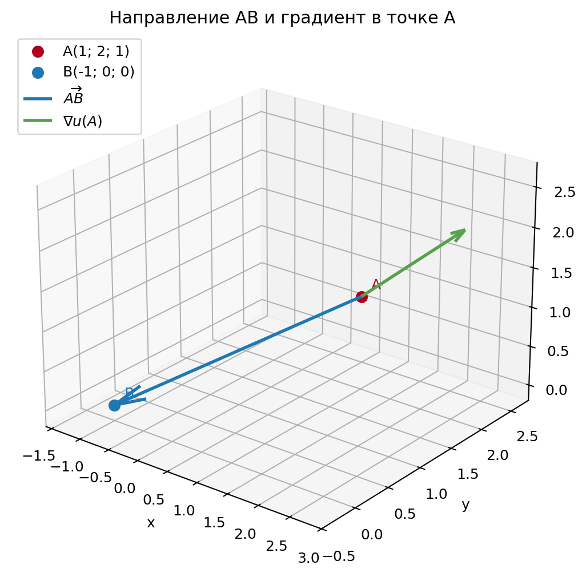

Частные производные:

$$
u_x=y+4z,\qquad u_y=x,\qquad u_z=\frac1{2\sqrt z}+4x.
$$

В точке \(A(1;2;1)\):

$$
u_x(A)=6,\qquad u_y(A)=1,\qquad u_z(A)=\frac92.
$$

Производная по направлению:

$$
\frac{\partial u}{\partial l}
=\operatorname{grad}u(A)\cdot \vec e
=6\left(-\frac23\right)+1\left(-\frac23\right)+\frac92\left(-\frac13\right).
$$

Получаем

$$
\boxed{
\frac{\partial u}{\partial l}=-\frac{37}{6}
}.
$$

---

## Задача 4

Дана поверхность

$$
\frac{x^2}{9}+\frac{y^2}{25}-\frac{z^2}{225}=0,
\qquad
A(\sqrt3;\sqrt5;2\sqrt{30}).
$$

Пусть

$$
F(x,y,z)=\frac{x^2}{9}+\frac{y^2}{25}-\frac{z^2}{225}.
$$

Проверка точки:

$$
F(A)=\frac3{9}+\frac5{25}-\frac{120}{225}
=\frac13+\frac15-\frac8{15}=0.
$$

Частные производные:

$$
F_x=\frac{2x}{9},\qquad
F_y=\frac{2y}{25},\qquad
F_z=-\frac{2z}{225}.
$$

В точке \(A\):

$$
F_x(A)=\frac{2\sqrt3}{9},\qquad
F_y(A)=\frac{2\sqrt5}{25},\qquad
F_z(A)=-\frac{4\sqrt{30}}{225}.
$$

Касательная плоскость:

$$
\frac{2\sqrt3}{9}(x-\sqrt3)
+\frac{2\sqrt5}{25}(y-\sqrt5)
-\frac{4\sqrt{30}}{225}(z-2\sqrt{30})=0.
$$

Умножая на \(225/2\), получаем

$$
25\sqrt3(x-\sqrt3)+9\sqrt5(y-\sqrt5)
-2\sqrt{30}(z-2\sqrt{30})=0.
$$

После раскрытия скобок:

$$
\boxed{
25\sqrt3\,x+9\sqrt5\,y-2\sqrt{30}\,z=0
}.
$$

Направляющий вектор нормали можно взять равным

$$
\vec n=(25\sqrt3;\,9\sqrt5;\,-2\sqrt{30}).
$$

Нормаль:

$$
\boxed{
\frac{x-\sqrt3}{25\sqrt3}
=
\frac{y-\sqrt5}{9\sqrt5}
=
\frac{z-2\sqrt{30}}{-2\sqrt{30}}
}.
$$

Графическая иллюстрация поверхности, касательной плоскости и нормали:

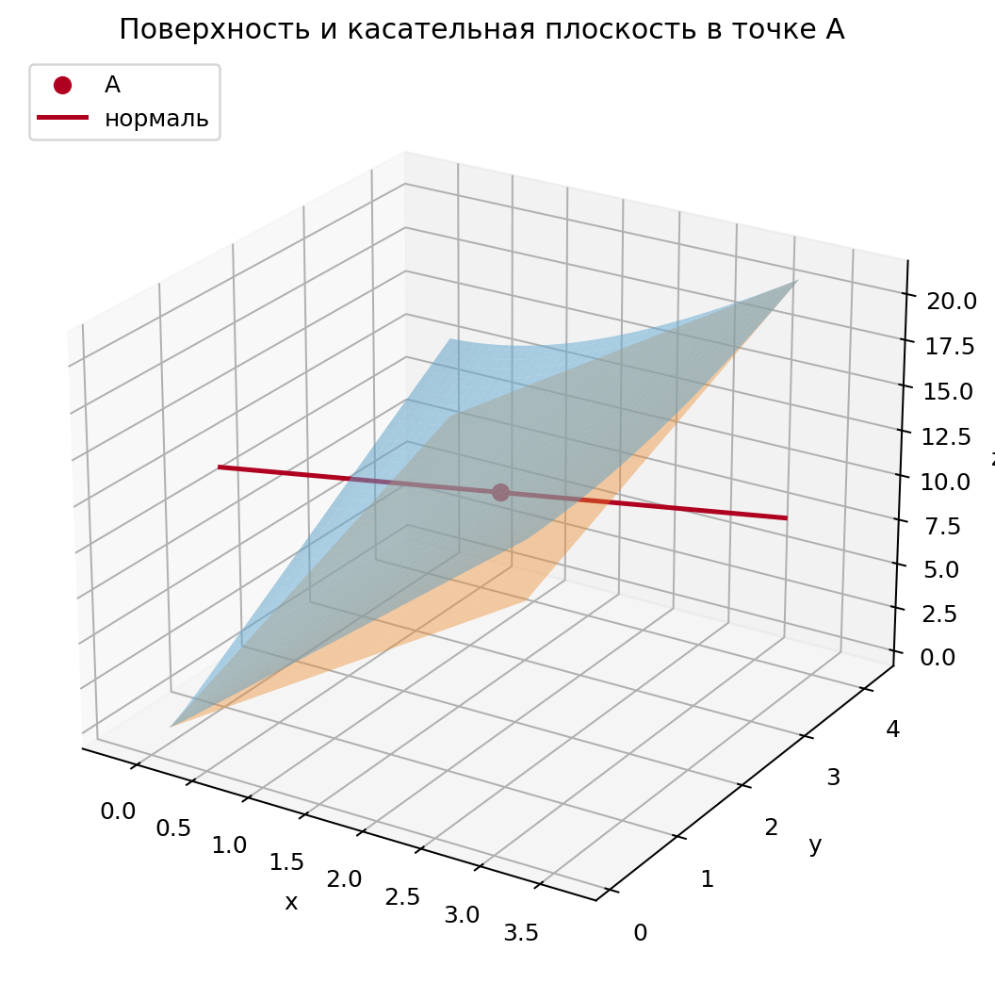

---

## Задача 5

Дана функция

$$
z=y^2-18\ln(xy)+6x-7\frac15.
$$

Здесь \(7\frac15=\frac{36}{5}\), то есть

$$
z=y^2-18\ln(xy)+6x-\frac{36}{5}.
$$

Область определения:

$$
xy>0.
$$

Частные производные:

$$
z_x=-\frac{18}{x}+6,
\qquad
z_y=2y-\frac{18}{y}.
$$

Стационарные точки находятся из системы

$$
-\frac{18}{x}+6=0,\qquad 2y-\frac{18}{y}=0.
$$

Отсюда

$$
x=3,\qquad y^2=9.
$$

При \(x=3\) условие \(xy>0\) оставляет только \(y=3\). Поэтому единственная стационарная точка:

$$
M(3;3).
$$

Вторые производные:

$$
z_{xx}=\frac{18}{x^2},
\qquad
z_{yy}=2+\frac{18}{y^2},
\qquad
z_{xy}=0.
$$

В точке \(M(3;3)\):

$$
z_{xx}=2,\qquad z_{yy}=4,\qquad z_{xy}=0.
$$

Определитель Гессе:

$$
\Delta=z_{xx}z_{yy}-z_{xy}^2=2\cdot4-0=8>0.
$$

Так как \(\Delta>0\) и \(z_{xx}>0\), в точке \(M(3;3)\) функция имеет локальный минимум.

Значение функции:

$$
z(3;3)=9-18\ln9+18-\frac{36}{5}
=\frac{99}{5}-18\ln9.
$$

Так как \(\ln9=2\ln3\),

$$
\boxed{
z_{\min}=\frac{99}{5}-18\ln9=\frac{99}{5}-36\ln3
}.
$$

В отрицательной компоненте области определения глобального минимума нет: например, при \(y=-1\), \(x\to-\infty\)

$$
z=1-18\ln(-x)+6x-\frac{36}{5}\to-\infty.
$$

Поэтому на всей области \(xy>0\) найденный экстремум является локальным минимумом. На положительной компоненте \(x>0,\ y>0\) это также наименьшее значение функции.

Ответ:

$$
\boxed{(3;3)\text{ -- точка локального минимума}.}
$$

Линии уровня функции около найденной точки минимума:

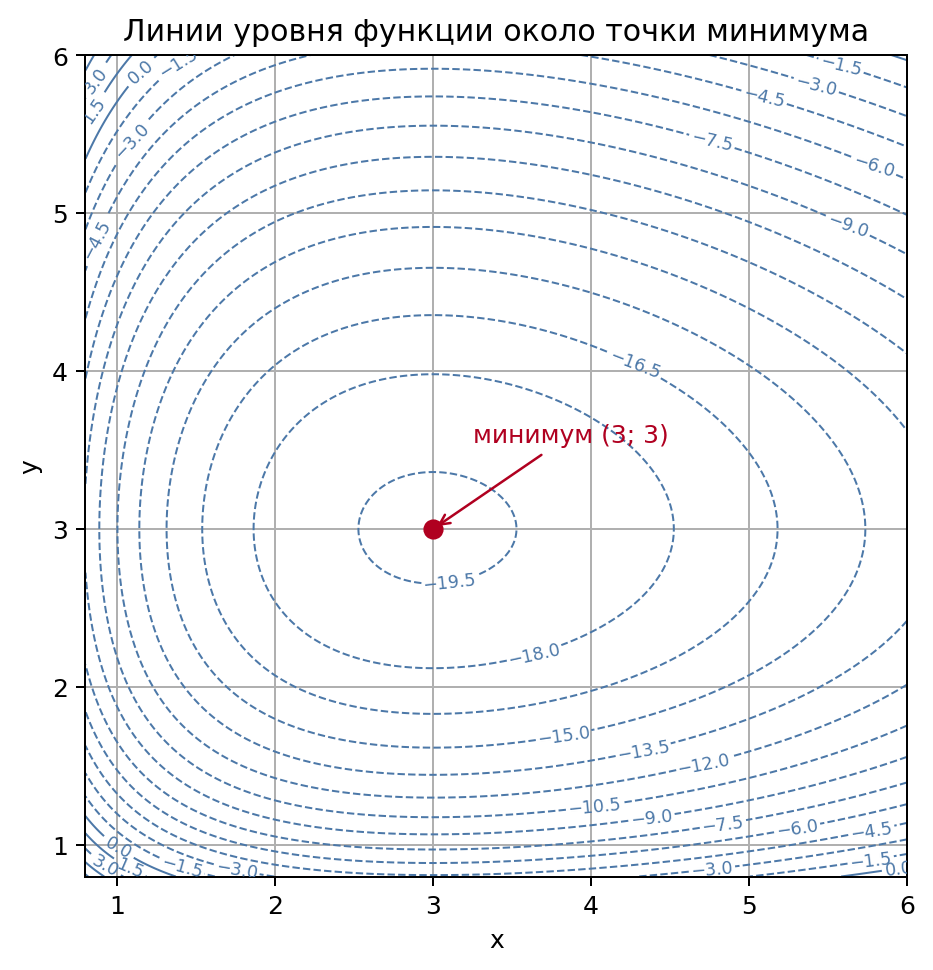

---

# 2. Приложения определенного интеграла

## Задача 1

Даны кривые

$$
y=\sqrt{x+1},\qquad y=\sqrt{7-x},\qquad y=0.
$$

Точка пересечения первых двух кривых:

$$
\sqrt{x+1}=\sqrt{7-x}
\quad\Longrightarrow\quad
x+1=7-x
\quad\Longrightarrow\quad
x=3.
$$

При \(x=3\):

$$
y=2.
$$

Пересечения с осью \(Ox\):

$$
\sqrt{x+1}=0 \Rightarrow x=-1,
\qquad
\sqrt{7-x}=0 \Rightarrow x=7.
$$

График ограниченной фигуры:

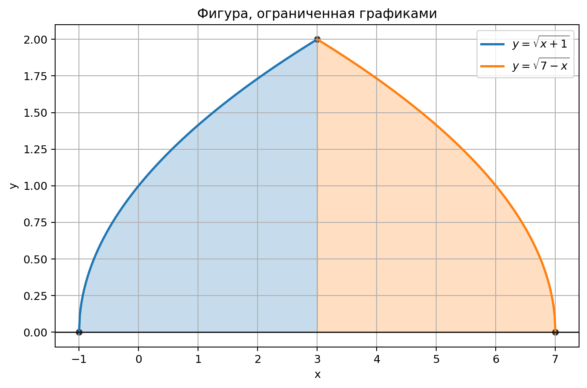

Площадь:

$$
S=\int_{-1}^{3}\sqrt{x+1}\,dx+\int_{3}^{7}\sqrt{7-x}\,dx.
$$

Вычисляем:

$$
\int_{-1}^{3}\sqrt{x+1}\,dx
=\left.\frac23(x+1)^{3/2}\right|_{-1}^{3}
=\frac{16}{3},
$$

$$
\int_{3}^{7}\sqrt{7-x}\,dx
=\frac{16}{3}.
$$

Следовательно,

$$
\boxed{
S=\frac{32}{3}
}.
$$

---

## Задача 2

Даны линии в полярных координатах

$$
r=2\cos3\varphi,\qquad r\ge 1.
$$

Нужно найти площадь частей трехлепестковой розы \(r=2\cos3\varphi\), лежащих вне окружности \(r=1\).

Точки пересечения:

$$
2\cos3\varphi=1
\quad\Longrightarrow\quad
\cos3\varphi=\frac12.
$$

Для лепестка около положительного направления оси \(Ox\):

$$
-\frac{\pi}{9}\le \varphi\le \frac{\pi}{9}.
$$

График показывает три одинаковые части розы, лежащие вне окружности \(r=1\):

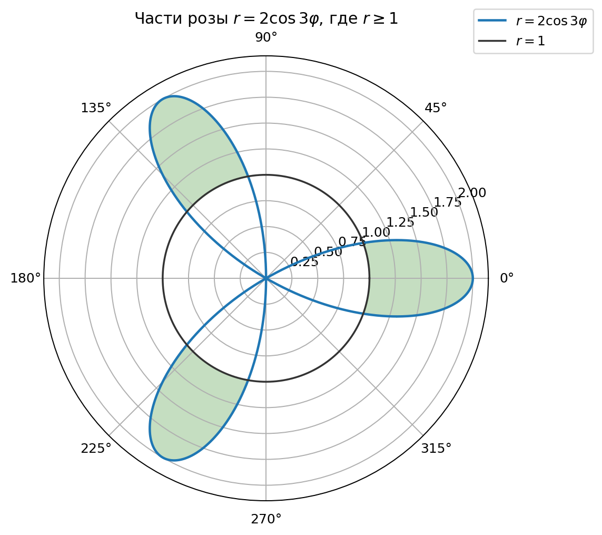

Площадь одного такого сегмента:

$$
S_1=\frac12\int_{-\pi/9}^{\pi/9}
\left((2\cos3\varphi)^2-1^2\right)d\varphi.
$$

С учетом четности:

$$
S_1=\int_0^{\pi/9}(4\cos^2 3\varphi-1)\,d\varphi.
$$

Всего лепестков три, поэтому

$$
S=3\int_0^{\pi/9}(4\cos^2 3\varphi-1)\,d\varphi.
$$

Так как

$$
4\cos^2 3\varphi-1=1+2\cos6\varphi,
$$

получаем

$$
S=3\left(\varphi+\frac13\sin6\varphi\right)\bigg|_0^{\pi/9}.
$$

Значит,

$$
S=3\left(\frac{\pi}{9}+\frac13\sin\frac{2\pi}{3}\right)
=3\left(\frac{\pi}{9}+\frac{\sqrt3}{6}\right).
$$

Итак,

$$
\boxed{
S=\frac{\pi}{3}+\frac{\sqrt3}{2}
}.
$$

---

## Задача 3

Даны кривые

$$
\frac{x^2}{9}-\frac{y^2}{25}=1,
\qquad
\frac{x^2}{25}-\frac{y^2}{9}=-1.
$$

Вариант 21 нечетный, поэтому фигура вращается вокруг оси \(Ox\).

Второе уравнение запишем так:

$$
\frac{y^2}{9}-\frac{x^2}{25}=1.
$$

Найдем точки пересечения. Пусть \(X=x^2\), \(Y=y^2\). Тогда

$$
\frac{X}{9}-\frac{Y}{25}=1,
\qquad
\frac{X}{25}-\frac{Y}{9}=-1.
$$

Решение:

$$
X=Y=\frac{225}{16}.
$$

Значит,

$$
x=\pm\frac{15}{4},\qquad y=\pm\frac{15}{4}.
$$

График области, которая вращается вокруг оси \(Ox\):

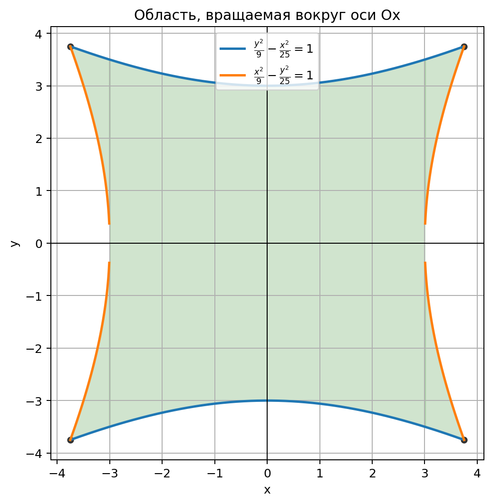

Верхняя граница задается гиперболой

$$
\frac{y^2}{9}-\frac{x^2}{25}=1,
$$

откуда

$$
R^2(x)=y^2=9+\frac{9x^2}{25}.
$$

Первая гипербола дает внутренний радиус только при \(|x|\ge3\):

$$
r^2(x)=\frac{25}{9}(x^2-9).
$$

Из-за симметрии по оси \(Oy\):

$$
V=2\pi\left[
\int_0^3 R^2(x)\,dx
+
\int_3^{15/4}(R^2(x)-r^2(x))\,dx
\right].
$$

Первый интеграл:

$$
\int_0^3 \left(9+\frac{9x^2}{25}\right)dx
=\left(9x+\frac{3x^3}{25}\right)\bigg|_0^3
=27+\frac{81}{25}
=\frac{756}{25}.
$$

Второй интеграл:

$$
\int_3^{15/4}
\left(
9+\frac{9x^2}{25}-\frac{25}{9}(x^2-9)
\right)dx
=
\int_3^{15/4}\left(34-\frac{544x^2}{225}\right)dx.
$$

Вычисляем:

$$
\left(34x-\frac{544x^3}{675}\right)\bigg|_3^{15/4}
=\frac{119}{25}.
$$

Тогда

$$
V=2\pi\left(\frac{756}{25}+\frac{119}{25}\right)
=2\pi\cdot35.
$$

Ответ:

$$
\boxed{
V=70\pi
}.
$$

Примечание: ответ \(\frac{238\pi}{25}\) получается, если ошибочно учитывать только боковые части при \(3\le |x|\le 15/4\) и не включать центральную часть области при \(0\le |x|\le 3\).

---

## Задача 4а

Дана кривая

$$
y=\ln(x^2-1),\qquad 2\le x\le5.
$$

График дуги:

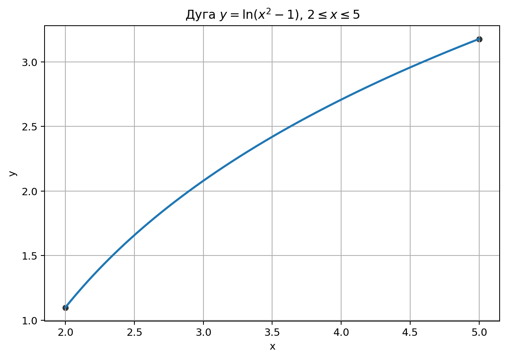

Длина дуги:

$$
L=\int_2^5\sqrt{1+(y')^2}\,dx.
$$

Производная:

$$
y'=\frac{2x}{x^2-1}.
$$

Тогда

$$
1+(y')^2
=1+\frac{4x^2}{(x^2-1)^2}
=\frac{(x^2-1)^2+4x^2}{(x^2-1)^2}
=\frac{(x^2+1)^2}{(x^2-1)^2}.
$$

На отрезке \(2\le x\le5\) имеем \(x^2-1>0\), поэтому

$$
\sqrt{1+(y')^2}=\frac{x^2+1}{x^2-1}.
$$

Следовательно,

$$
L=\int_2^5\frac{x^2+1}{x^2-1}\,dx.
$$

Преобразуем:

$$
\frac{x^2+1}{x^2-1}
=1+\frac2{x^2-1}
=1+\frac1{x-1}-\frac1{x+1}.
$$

Тогда

$$
L=\left(x+\ln|x-1|-\ln|x+1|\right)\bigg|_2^5.
$$

Получаем

$$
L=\left(5+\ln\frac46\right)-\left(2+\ln\frac13\right)
=3+\ln2.
$$

Ответ:

$$
\boxed{
L=3+\ln2
}.
$$

---

## Задача 4б

Дана параметрическая кривая

$$
x=2\cos^3t,\qquad y=\sin^3t,
\qquad 0\le t\le\frac{\pi}{6}.
$$

График параметрической дуги:

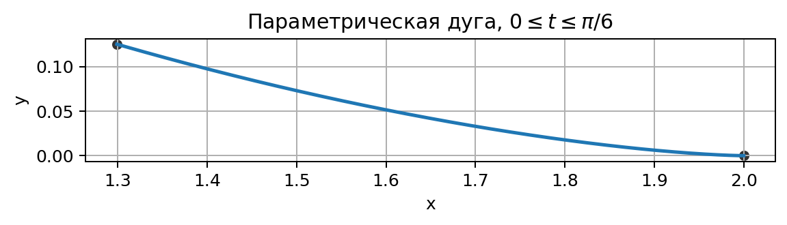

Длина дуги:

$$
L=\int_0^{\pi/6}\sqrt{(x')^2+(y')^2}\,dt.
$$

Производные:

$$
x'=-6\cos^2t\sin t,
\qquad
y'=3\sin^2t\cos t.
$$

Тогда

$$
(x')^2+(y')^2
=36\cos^4t\sin^2t+9\sin^4t\cos^2t.
$$

Выносим общий множитель:

$$
(x')^2+(y')^2
=9\sin^2t\cos^2t(4\cos^2t+\sin^2t)
=9\sin^2t\cos^2t(1+3\cos^2t).
$$

На данном отрезке \(\sin t\ge0\), \(\cos t\ge0\), поэтому

$$
L=\int_0^{\pi/6}
3\sin t\cos t\sqrt{1+3\cos^2t}\,dt.
$$

Положим

$$
u=1+3\cos^2t.
$$

Тогда

$$
du=-6\sin t\cos t\,dt,
\qquad
3\sin t\cos t\,dt=-\frac12du.
$$

Пределы:

$$
t=0 \Rightarrow u=4,
\qquad
t=\frac{\pi}{6}\Rightarrow u=\frac{13}{4}.
$$

Отсюда

$$
L=-\frac12\int_4^{13/4}u^{1/2}\,du
=\frac12\int_{13/4}^{4}u^{1/2}\,du.
$$

Вычисляем:

$$
L=\frac12\cdot\frac23 u^{3/2}\bigg|_{13/4}^{4}
=\frac13\left(4^{3/2}-\left(\frac{13}{4}\right)^{3/2}\right).
$$

Так как

$$
4^{3/2}=8,
\qquad
\left(\frac{13}{4}\right)^{3/2}=\frac{13\sqrt{13}}8,
$$

получаем

$$
\boxed{
L=\frac{64-13\sqrt{13}}{24}
}.
$$

---

## Задача 5

Дана кривая

$$
x=2\cos t-\cos2t,
\qquad
y=2\sin t-\sin2t,
\qquad
0\le t\le2\pi.
$$

Нужно найти площадь поверхности, образованной при вращении вокруг оси \(Ox\).

Кривая симметрична относительно оси \(Ox\). При вращении верхняя и нижняя половины дают одну и ту же поверхность, поэтому достаточно взять верхнюю половину:

$$
0\le t\le\pi.
$$

График исходной кривой; для вычисления площади поверхности используется верхняя половина:

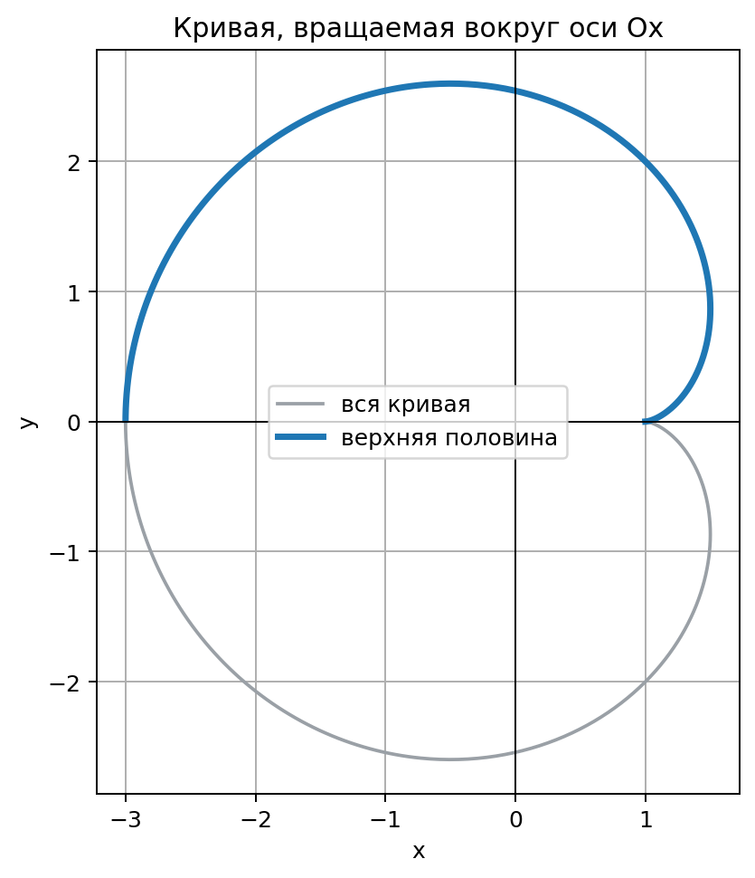

Визуализация получающейся поверхности вращения:

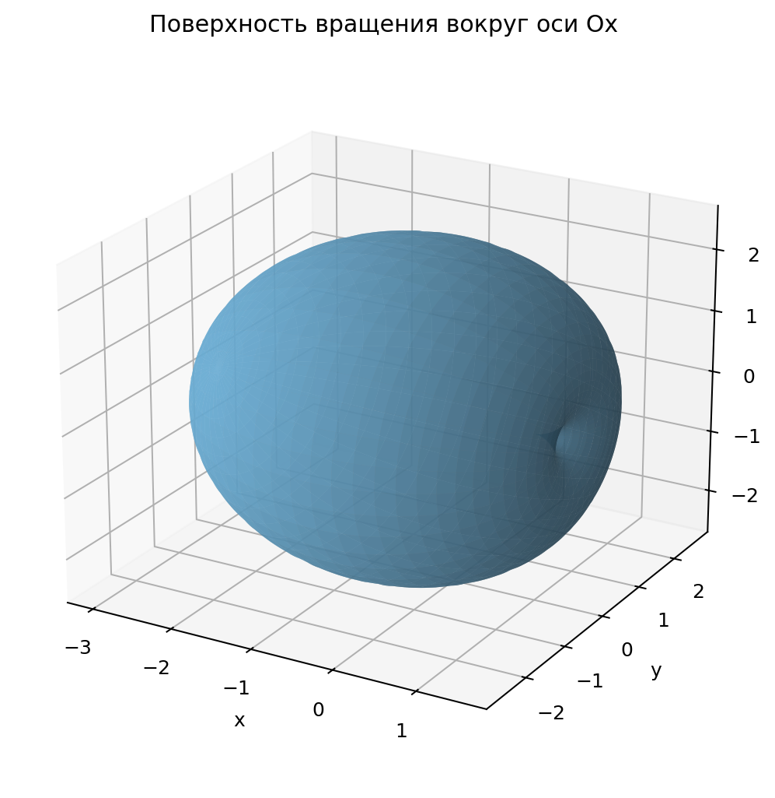

Формула площади:

$$
S=2\pi\int_0^\pi y(t)\sqrt{(x')^2+(y')^2}\,dt.
$$

Производные:

$$
x'=-2\sin t+2\sin2t,
\qquad
y'=2\cos t-2\cos2t.
$$

Скорость:

$$
\sqrt{(x')^2+(y')^2}=4\sin\frac t2
\quad
(0\le t\le\pi).
$$

Также

$$
y=2\sin t-\sin2t
=2\sin t(1-\cos t).
$$

Используя формулы половинного угла:

$$
\sin t=2\sin\frac t2\cos\frac t2,
\qquad
1-\cos t=2\sin^2\frac t2,
$$

получаем

$$
y=8\sin^3\frac t2\cos\frac t2.
$$

Тогда

$$
S=2\pi\int_0^\pi
8\sin^3\frac t2\cos\frac t2
\cdot
4\sin\frac t2
\,dt.
$$

То есть

$$
S=64\pi\int_0^\pi
\sin^4\frac t2\cos\frac t2\,dt.
$$

Пусть

$$
u=\sin\frac t2,
\qquad
du=\frac12\cos\frac t2\,dt.
$$

Пределы:

$$
t=0 \Rightarrow u=0,
\qquad
t=\pi \Rightarrow u=1.
$$

Получаем

$$
S=64\pi\int_0^1 u^4\cdot2\,du
=128\pi\int_0^1u^4\,du.
$$

Следовательно,

$$
S=128\pi\cdot\frac15.
$$

Ответ:

$$
\boxed{
S=\frac{128\pi}{5}
}.
$$

---

## Задача 6

### Первый интеграл

$$
I=\int_0^\infty e^{-7x}\cos2x\,dx.
$$

Первообразная:

$$
\int e^{-7x}\cos2x\,dx
=
\frac{e^{-7x}(-7\cos2x+2\sin2x)}{53}.
$$

Тогда

$$
I=
\lim_{b\to\infty}
\left.
\frac{e^{-7x}(-7\cos2x+2\sin2x)}{53}
\right|_0^b.
$$

При \(x\to\infty\) множитель \(e^{-7x}\to0\), поэтому верхний предел равен \(0\). При \(x=0\):

$$
\frac{e^0(-7\cos0+2\sin0)}{53}=-\frac7{53}.
$$

Следовательно,

$$
\boxed{
\int_0^\infty e^{-7x}\cos2x\,dx=\frac{7}{53}
}.
$$

Интеграл сходится.

### Второй интеграл

$$
J=\int_0^1
\cos\left(\frac{\pi}{1-x}\right)
\frac{dx}{(1-x)^2}.
$$

Интеграл несобственный при \(x\to1-0\). Сделаем замену

$$
u=\frac{\pi}{1-x}.
$$

Тогда

$$
du=\frac{\pi}{(1-x)^2}\,dx,
\qquad
\frac{dx}{(1-x)^2}=\frac{du}{\pi}.
$$

Пределы:

$$
x=0 \Rightarrow u=\pi,
\qquad
x\to1-0 \Rightarrow u\to+\infty.
$$

Получаем

$$
J=\frac1\pi\int_\pi^\infty\cos u\,du
=\frac1\pi\lim_{b\to\infty}\left[\sin u\right]_\pi^b
=\frac1\pi\lim_{b\to\infty}\sin b.
$$

Предел \(\lim_{b\to\infty}\sin b\) не существует, поэтому

$$
\boxed{
J\text{ расходится}
}.
$$

---

## Задача 7

Нужно найти работу, необходимую для подъема тела массы \(M\) с поверхности Земли радиуса \(R\) на высоту \(H\).

Схема физической модели:

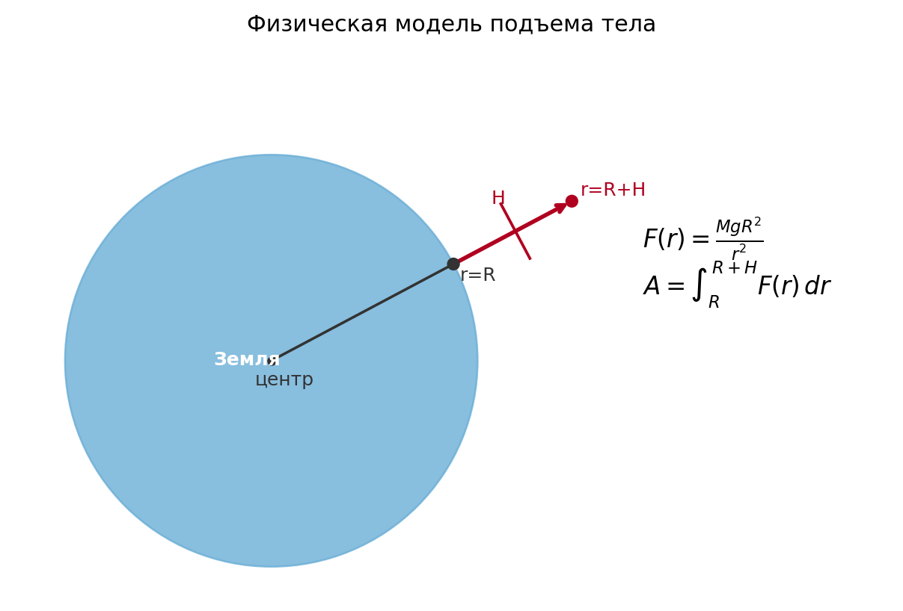

Пусть \(r\) -- расстояние от центра Земли до тела. Сила притяжения:

$$
F(r)=G\frac{M_{\text{З}}M}{r^2}.
$$

На поверхности Земли:

$$
Mg=G\frac{M_{\text{З}}M}{R^2},
$$

поэтому

$$
GM_{\text{З}}=gR^2.
$$

Тогда

$$
F(r)=\frac{MgR^2}{r^2}.
$$

Работа при подъеме от \(r=R\) до \(r=R+H\):

$$
A=\int_R^{R+H}\frac{MgR^2}{r^2}\,dr.
$$

Вычисляем:

$$
A=MgR^2\int_R^{R+H}r^{-2}\,dr
=MgR^2\left(-\frac1r\right)\bigg|_R^{R+H}.
$$

Следовательно,

$$
A=MgR^2\left(\frac1R-\frac1{R+H}\right)
=MgR^2\cdot\frac{H}{R(R+H)}.
$$

Ответ:

$$
\boxed{
A=\frac{MgRH}{R+H}
}.
$$
